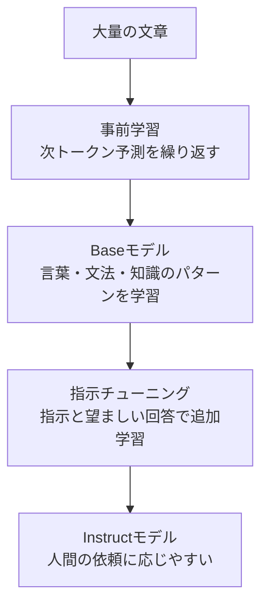
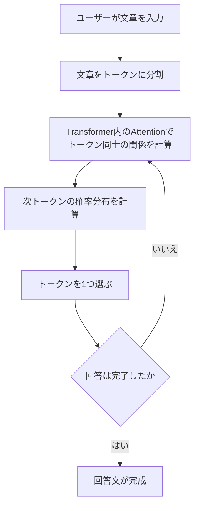

# ローカルLLM作成30日チャレンジ Day6(7月26日) Transformerと次トークン予測

ローカルLLM作成30日チャレンジのDay6です。

前回はTinySwallowとQwenを同じ10問で比較し、自然な文章でも、専門用語や資料中の制約を間違えることがあると分かりました。

今回は一歩戻って、そもそもLLMはどのように文章を作っているのかを見ていきます。テーマは、次トークン予測、Attention、Transformer、事前学習、指示チューニングです。

## 今日やったこと

### 次トークン予測を体験

最初に、文章の続きを候補と確率に分けて考えました。

```text
日本の首都は
```

この続きなら「東京」がかなり高い確率になりそうです。一方で、次の文では複数の自然な続きが考えられます。

```text
私は銀行へ
```

「行く」「行きます」などの候補を挙げ、全候補の確率が合計100%になるように考えました。

LLMは文章全体を一度に作っているわけではありません。直前までのトークンをもとに、次に来るトークンの確率分布を計算し、トークンを1つ選びます。選んだトークンを入力に加えて同じ処理を繰り返すことで、回答文を作っています。

Day3で試した `temperature` もここにつながります。`temperature` はLLMの知識量を増やすものではなく、次トークン候補の確率分布と選ばれ方に影響する設定です。

### AttentionとTransformer

次に、Attentionを確認しました。

```text
太郎は公園で犬を見つけました。
彼はうれしそうに犬へ近づきました。
```

この文の「彼」は太郎を指すと考えるのが自然です。「太郎」「彼」「犬」「近づく」などの関係を見ることで、文脈を捉えられます。

Attentionは、次トークンを予測するとき、入力中のどのトークンをどれくらい重視するかを計算する仕組みです。すべての言葉を同じ強さで見るのではなく、関係の強さを数値として扱います。

TransformerはAttentionの別名ではありません。Attentionなどの処理を何層も組み合わせ、文脈を踏まえた次トークン予測を可能にするモデル構造です。

この時点では、次のように理解しました。

- Attentionは、どのトークンをどれくらい重視するか計算する仕組み
- Transformerは、Attentionなどの処理を組み合わせて何層も重ねたモデル構造

内部の数式までは入りませんでしたが、この2つを同じものとして扱わないことが今日のポイントでした。

### 事前学習と指示チューニング

事前学習では、大量の文章を使って次トークン予測を繰り返します。

```text
元の文章: 日本の首都は東京です

入力: 日本の首都は
予測: 大阪
正解: 東京
```

予測と正解のずれを `loss（損失）` と呼びます。このlossが小さくなるようにモデル内部のパラメータを調整し、膨大な文章で繰り返すことで、言葉の使い方、文法、知識などのパターンを取り込みます。

ただし、事前学習だけでは、「要約してください」「質問に答えてください」といった人間の依頼にうまく応じるとは限りません。

そこで、「指示と望ましい回答」の組を使って追加学習するのが指示チューニングです。



TinySwallowのモデル名にある `1.5B-Instruct` は、約15億個のパラメータを持ち、人間の指示に応じやすいよう調整されたモデルであることを示しています。

ただし、`Instruct`だから指示を必ず守れるわけではありません。前回の比較では、指定した形式や資料中の制約を守れない回答もありました。指示チューニングは、指示に応じる傾向を身につけさせるもので、正確性を保証するものではないと理解しました。

### 回答が作られる流れを整理

最後に、Instructモデルが回答を作る流れを図にしました。



これで、事前学習や指示チューニングは「モデルを作る流れ」、次トークン予測は「できたモデルが回答を作る流れ」だと分けて考えられるようになりました。

## 今日のハマりポイント

今日は実装や環境構築がなかったので、大きなエラーはありませんでした。

ただ、途中でCodexから出された穴埋め図が分かりにくい場面がありました。「モデルを作る流れ」と「モデルが回答を作る流れ」が1つの図に混ざっていて、何を答えればよいか分からない状態になっていました。

そこで、図を2つに分けました。

- 大量の文章から、事前学習と指示チューニングを経てInstructモデルを作る流れ
- Instructモデルが、Attentionと次トークン予測を使って回答を作る流れ

分けてみると、学習時の話と回答生成時の話が整理でき、かなり理解しやすくなりました。

## 今日の感想

これまで「LLMは次の言葉を予測している」という説明は聞いたことがありましたが、確率の候補を自分で考え、Attentionや事前学習までつなげたことで、少し具体的に理解できました。

今日のポイントは次の4つです。

- LLMは次トークンの確率分布を計算し、1つずつ選んで文章を作る
- Attentionは、入力中のどのトークンを重視するか計算する
- Transformerは、Attentionなどの処理を何層も組み合わせたモデル構造
- Instructモデルは指示に応じやすく調整されているが、正しさを保証するものではない

前回、TinySwallowがRAGを別の言葉として説明したことも、今日の話とつながりました。LLMは辞書から正解をそのまま取り出すのではなく、確率的にありそうな次トークンを選び続けています。そのため、文章が自然でも事実と反する場合があります。

数式や内部構造の細部はまだ分かりませんが、まずは「モデルを作る流れ」と「モデルが回答する流れ」を分けて説明できれば、今日のところは十分かなと思います。

次はDay1からDay6までを振り返り、用語と「ローカルでLLMを動かすとは何か」を整理します。
