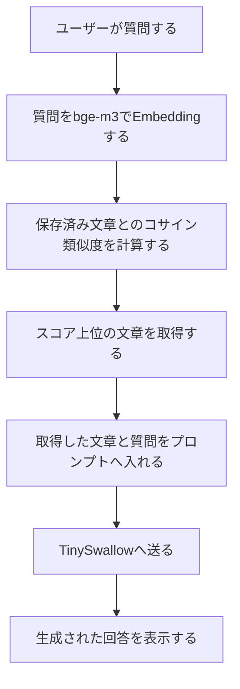

# ローカルLLM作成30日チャレンジ Day17・18(8月3日) RAGの設計からチャンクサイズ比較まで一気に進めた

ローカルLLM作成30日チャレンジのDay17とDay18です。

今回は2日分を1日でまとめて進めました。Day17でRAGの全体像を整理し、そのままDay18のチャンク分割とベクトル検索比較へ進みます。

RAGもチャンクも言葉としては知っていましたが、Day16で作ったベクトル検索からどうつながるのかを、構成図、コード、実際の検索結果で確認しました。

## 今日やったこと

### RAGを「検索→文脈注入→回答生成」に分ける

Day16で実装したベクトル検索は、質問に意味が近い文章を取得するところまでです。RAGでは、取得した文章を質問と一緒にLLMへ渡し、その情報を前提に回答を生成させます。



RAGの回答が悪いときは、検索で必要な文章を取得できたかと、LLMが取得した文章に沿って回答できたかを分けて確認します。検索が失敗しているなら、回答生成モデルだけを高性能にしても根本的な解決にはなりません。

### RAGとファインチューニングの違いを整理する

RAGは、回答時に外部データを検索し、取得した文章を根拠としてLLMへ渡す方法です。社内規則のように更新される知識を扱う用途に向いています。

一方のファインチューニングは、回答の傾向、文体、出力形式など、モデルの振る舞いを調整するのが基本です。両者は二者択一ではなく、組み合わせることもできます。

### 2860文字のMarkdownを3種類のサイズで分割する

Day18では、`notes/day14_api_summary.md`を300文字、500文字、1000文字ごとに分割しました。

```text
300文字チャンク: 10個
500文字チャンク: 6個
1000文字チャンク: 3個
```

固定文字数で分割すると、`OpenAI`が`O`と`penAI`に分かれたり、「記憶」が「記」と「憶」に分かれたりしました。実装は簡単ですが、文章や単語の区切りは保証されません。

### 2つの質問でチャンクサイズを比較する

各サイズで分割したチャンクを`bge-m3`でEmbeddingし、同じ質問とのコサイン類似度を比べました。

1問目では、OpenAI互換APIの定義を検索します。

```text
OpenAI互換APIとは何ですか？
```

この質問では、500文字の1位に直接的な定義が入り、比較的使いやすい結果になりました。300文字では定義が2位に入り、1000文字では定義と一緒に無関係な話題も多く含まれました。

2問目では、会話履歴の管理に関する説明を検索しました。

```text
会話履歴はどこに保存されますか？
```

300文字の1位には、次の内容がまとまっていました。

```text
過去の会話を毎回モデルへ渡す。モデル自身が会話を記憶するのではなく、Pythonアプリが履歴を管理する。
```

一方、500文字と1000文字の1位は、どちらも「憶するのではなく」から始まりました。「記憶」がチャンク境界で切れています。

1000文字の1位はスコア`0.5557`で3種類の中では最高でした。しかし、文頭が分断され、質問に関係しない話題も多く混ざっています。最高スコアと、回答材料としての使いやすさは別でした。

1問目は500文字、2問目は300文字が比較的使いやすく、質問によって結果が変わりました。チャンクサイズはスコアだけではなく、必要な情報が1チャンクに入っているか、文脈が切れていないか、無関係な情報が多すぎないかで評価する必要があります。

## 今日のハマりポイント

Day17では、Codexがすでに理解できているRAGの基礎確認を繰り返し、同じ内容のまとめまで求めてしまいました。また、「検索結果」が何を指すのかも曖昧でした。設計メモでは「ベクトル検索で取得した文章」など、対象が分かる表現へ修正しました。

Day18では、最初に作ったファイル名が`chunk_test.py`で、実行した`chunk_text.py`と異なっていたため、`No such file or directory`と表示されました。ファイル名を修正すると正しく実行できました。

その後、Codexがチャンクを分割しただけでDay18を終えようとしました。しかし、計画にある「検索しやすさの違いを見る」には実際のベクトル検索比較が必要です。これはCodex側の進行確認不足で、実装を追加して2つの質問で比較しました。

初回の検索結果も長く、3種類を比べにくい状態でした。そこで、サイズごとの上位3件と各サイズの1位を並べる形式へCodexに修正してもらいました。

## 今日の感想

RAGの構成を整理してすぐにチャンク分割へ進んだことで、Day16のベクトル検索がRAG実装の検索部分としてつながってきました。

特に印象に残ったのは、1000文字のチャンクが一番高い類似度スコアを出しても、回答材料として一番使いやすいとは限らなかったことです。数値だけではなく、取得した文章で実際に質問へ答えられるかを見る必要があります。

チャンクサイズに共通の正解はなく、質問と文書に合わせて実験しながら決めるものなのだと思います。次は、取得したチャンクをTinySwallowへ渡し、最小構成のRAGを実装します。
