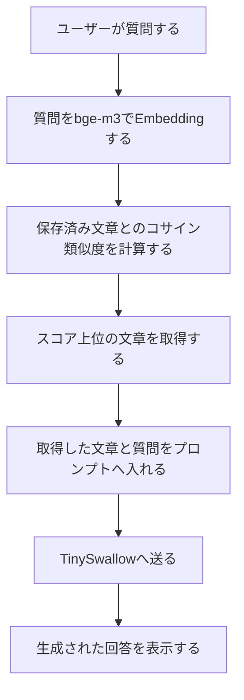

# ローカルLLM作成30日チャレンジ Day17(8月3日) RAGの全体像を検索と回答生成に分けて整理した

ローカルLLM作成30日チャレンジのDay17です。

前回は、`bge-m3`で文章をベクトル化し、コサイン類似度を使って質問に近い文章を探しました。今回はその検索をTinySwallowの回答生成へつなげる、RAGの全体像を整理します。

RAG自体はすでに知っていたのですが、実装前の設計として「どこまでが検索で、どこからが回答生成か」を分けてみました。

## 今日やったこと

### Day16のベクトル検索からRAGへつなげる

ベクトル検索は、質問に意味が近い文章を取得するところまでです。検索した文章を読み、回答を組み立てるのは人間の仕事として残っています。

RAGでは、ベクトル検索で取得した文章を参考情報として質問と一緒にLLMへ渡し、回答文を生成させます。処理の流れを並べると次のようになります。

Day16で作ったものは、このうちEmbeddingから類似文章の取得までです。そこへ、取得した文章の文脈注入とTinySwallowによる回答生成を足すと、最小構成のRAGになります。

この構成図と設計メモの骨組みは自分で入力し、未反映だった節の補完と表現の整理はCodexに代行してもらいました。

### RAGとファインチューニングの使い分け

自分の理解では、RAGは与えられたデータや前提条件をもとに回答させる手法です。一方のファインチューニングは、回答の傾向、文体、形式など、モデルの振る舞いを調整するときに使います。

社内規則のように内容が更新される知識は、文書を差し替えて検索できるRAGと相性がよさそうです。ただし、両者は二者択一ではなく、振る舞いを調整したモデルにRAGで外部知識を渡す構成も可能です。

### RAGの失敗を二つに分ける

RAGの回答が悪いとき、回答を作ったLLMだけが原因とは限りません。

- 検索側：質問に必要な文章を取得できたか
- 回答生成側：LLMが取得した文章に沿って回答したか

Embeddingや検索の精度が悪ければ、回答生成モデルを高性能に変えても、正しい根拠は渡りません。どこで失敗したかを分けて確認する必要があります。

## 今日のハマりポイント

今日は実装上の大きなエラーはありませんでした。しかし、Codexがすでに理解できているRAGの基礎確認を何度も繰り返し、最後に同じ内容のまとめまで求めてしまいました。

また、「検索結果」という表現だけでは、ベクトル検索で取得した文章を指していることが分かりにくくなっていました。設計メモでは「ベクトル検索で取得した文章」など、何を指すか分かる表現へ修正しました。

今後は、理解済みの内容を繰り返し質問するのではなく、既存の理解を前提に次の設計や実装へ進む必要があると感じました。

## 今日の感想

RAGとベクトル検索を混同していたわけではなく、ベクトル検索がRAGの構成の一部としてどこに入るかを図にしました。

今回の収穫は、RAGの定義を知ったことより、Day16で作った検索処理が、これから作るRAGのどこに使われるかを実装単位で整理できたことかなと思います。次回は、RAGで検索しやすい単位に文書を分ける、チャンク分割を試します。
