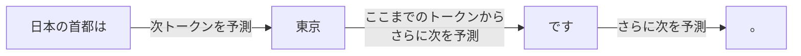
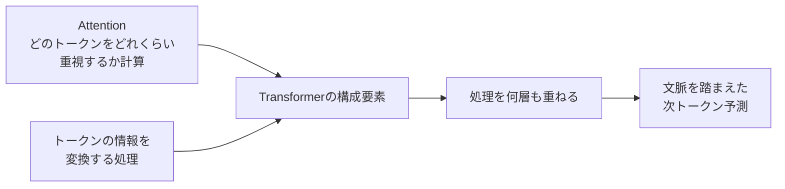
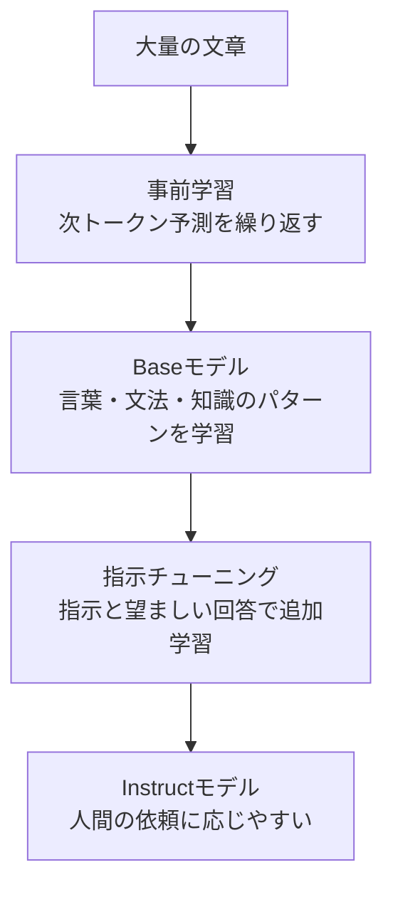
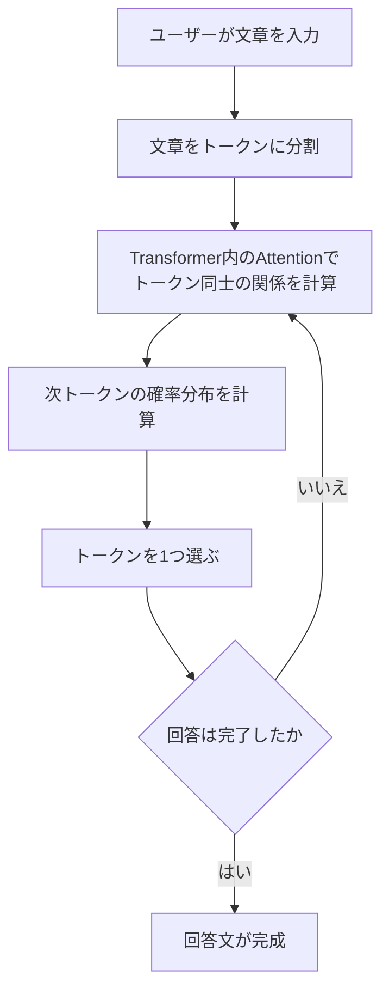

# Day 6: Transformerと次トークン予測

## LLMは次トークン予測モデル

LLMは、直前までのトークン列をもとに、次に来るトークンの確率分布を計算し、その中から出力するトークンを選びます。



この処理を繰り返すことで、回答文を生成します。

確率分布は候補全体で合計100%になります。また、常に最も確率が高い候補を選ぶとは限りません。Day 3で確認した `temperature` は、次トークン候補の確率分布と選ばれ方に影響する生成パラメータです。

## Attentionとは

Attentionは、次のトークンを予測する際に、入力中のどのトークンをどれくらい重視するかを計算する仕組みです。

たとえば、次の文では「彼」と「太郎」の関係を強く見ることで、「彼」が誰を指すのかを捉えやすくなります。

```text
太郎は公園で犬を見つけました。
彼はうれしそうに犬へ近づきました。
```

複数のAttentionが、指示語と対象、主語と動作、物と性質など、異なる関係を並行して捉える仕組みを `Multi-Head Attention` と呼びます。

ただし、Attentionが人間のように意味を意識して理解しているということではありません。トークン同士の関係の強さを数値として計算しています。

## Transformerとは

TransformerはAttentionだけの別名ではありません。

Attentionなどの処理を何層も組み合わせ、各トークンについて文脈を踏まえた情報を作るモデル構造です。LLMはこの構造を使って次トークンを予測します。



## 事前学習とは

事前学習では、大量の文章を使って次トークン予測を繰り返します。

```text
元の文章: 日本の首都は東京です

入力: 日本の首都は
予測: 大阪
正解: 東京
```

予測と正解のずれを数値化したものを `loss（損失）` と呼びます。元の文章にある実際の次トークンを正解として使い、lossが小さくなるようにモデルのパラメータを調整します。

これを膨大な文章で繰り返すことで、言葉の使い方、文法、知識などのパターンをパラメータへ取り込みます。

## 指示チューニングとは

事前学習済みのBaseモデルは文章の続きを生成できますが、人間の指示に適切に応じるとは限りません。

指示チューニングでは、「指示と望ましい回答」の組を使って追加学習し、質問への回答、要約、指定形式での出力など、人間の依頼に応じやすい振る舞いへ調整します。

TinySwallowのモデル名にある `Instruct` は、指示チューニング済みであることを示します。

```text
1.5B     : 約15億個のパラメータ
Instruct : 指示に応じるよう調整済み
```

ただし、指示チューニングは指示への対応や正確性を保証するものではありません。Day 5では、Instructモデルでも指定した形式や資料中の制約を守れない場合がありました。

## 全体像

### モデルを作る流れ



### Instructモデルが回答を作る流れ



## 自然な文章でも間違う理由

LLMは、事実の正しさを直接確認して文章を作るのではなく、学習したパターンと確率分布をもとに次トークン予測を繰り返します。

そのため、文章として自然で、確率的にありそうな回答であっても、内容が事実と異なる場合があります。
