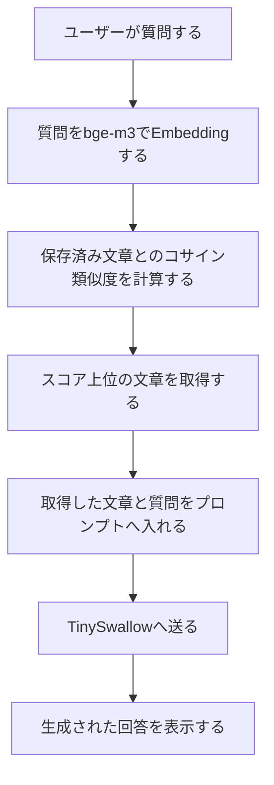

# Day17 RAGの全体像

## RAGとは
RAGは、ユーザーの質問に関連する外部データを検索し、取得した文章を文脈としてLLMへ渡して回答を生成する手法です。

モデル内部の知識だけに頼らず、回答時に取得した情報を前提として回答させます。ただし、正しい回答が保証されるわけではなく、検索と回答生成の両方で失敗する可能性があります。

## 処理の流れ

## 各処理の役割
- **Embedding**：質問と保存済み文章を、意味を比較できるベクトルへ変換します。
- **検索**：質問ベクトルと保存済み文章のベクトルを比較し、類似度の高い文章を取得します。
- **文脈注入**：ベクトル検索で取得した文章を参考情報として、ユーザーの質問と一緒にプロンプトへ入れます。
- **回答生成**：TinySwallowが、渡された参考情報をもとに回答文を作ります。

## RAGとファインチューニングの違い
- **RAG**：回答時に外部データを検索し、その情報を根拠としてLLMへ渡します。社内規則など、更新される知識を扱う用途に向いています。
- **ファインチューニング**：学習データを使って、モデルの回答傾向、文体、出力形式、特定タスクへの振る舞いを調整します。
- 外部知識を更新しながら回答へ反映したい場合はRAG、回答の仕方や振る舞いを変えたい場合はファインチューニングが基本です。両方を組み合わせることもできます。

## RAGで回答を間違える原因
### 検索側の問題

- Embeddingが質問や文章の意味を適切に表現できない
- 必要な文章が検索対象に入っていない
- 関係のない文章を類似文として取得する
- 必要な文章が検索順位の上位に入らない

### 回答生成側の問題

- LLMが取得した文章の内容を誤って解釈する
- 取得した文章にない情報を付け足す
- 取得した複数の文章が矛盾し、誤った情報を選ぶ
- 指示に従わず、モデル内部の知識を優先する

RAGの回答が悪いときは、必要な文章を検索で取得できたかを先に確認し、その後でLLMが取得した文章に沿って回答したかを確認します。検索に失敗している場合、回答生成モデルだけを高性能にしても根本的な解決にはなりません。
