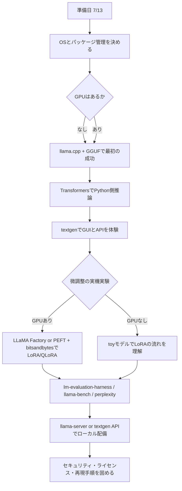

# ローカルLLM入門30日チャレンジ学習計画

## エグゼクティブサマリ

この計画は、**準備日が 2026-07-13、学習本番が 2026-07-14 から 2026-08-12 までの30日間**という前提で作成した、初心者寄り・実務寄りの学習ロードマップです。あなたの条件では、**平日 1 時間 × 22 日 + 土日 3 時間 × 8 日 = 合計 46 時間**を使えます。46 時間で「理論を広く読む」よりも、**最初に動く環境を作り、次に比較し、最後に小さく調整して公開可能なかたちまで持っていく**ほうが習得効率は高いです。ローカルLLM学習の最短経路としては、**推論の第一成功体験は `llama.cpp + GGUF`、Python側の理解と微調整は `Transformers + PEFT + bitsandbytes`、GUIは `textgen`、初心者向け微調整UIは `LLaMA Factory`、評価は `lm-evaluation-harness` と `llama-bench / llama-perplexity`、配備は `llama-server` か `textgen` のローカルAPI**という組み合わせがもっとも実務的です。`llama.cpp` は広いハードウェアでのローカル推論を主眼にしており、GGUF は GGML 系実行環境向けに高速ロードを意図した形式です。Transformers は推論・学習の基礎フレームワークで、PEFT の LoRA は学習パラメータを大幅に減らし、bitsandbytes の QLoRA は 4-bit 量子化でメモリ負荷を下げながら追加パラメータ学習を行えます。`textgen` は複数バックエンド・ローカルAPI・LoRA学習・完全オフライン運用をまとめて触れるのに向いています。citeturn9search1turn17view6turn13search2turn10view3turn12view1turn26view2turn10view4turn11view8

この30日で到達すべき現実的なゴールは、次の三層に分けるとぶれません。**第一層**は、Transformer・トークン・コンテキスト長・量子化・LoRA/QLoRA・推論サーバーなどの基本語彙を「説明できる」状態です。**第二層**は、OSを問わずローカル環境を整理し、GGUF と safetensors の違いを理解し、`llama.cpp`・Transformers・GUI のいずれかで小〜中規模モデルを実行できる状態です。**第三層**は、微調整データを小さく作り、LoRA か QLoRA で 1 回以上の実験を行い、簡単な評価とデバッグ、ローカルAPI公開、セキュリティ・ライセンス確認まで完了することです。Hugging Face の日本語 LLM Course と日本語版 Transformers ドキュメントは、この順序にかなり相性がよく、特に「概念理解 → pipeline 推論 → fine-tuning → デバッグ」の流れが明確です。citeturn28view0turn28view1turn24view5turn13search5turn17view4

一方で、**GPU の有無で達成可能な“微調整の深さ”は変わります**。bitsandbytes の 8-bit / 4-bit 系は主に CUDA 系 GPU を前提に設計されており、4-bit / 8-bit 学習は「追加パラメータの学習」に限定されます。つまり、**GPU あり**なら 1B〜7B/8B 級のアダプタ調整を実践しやすい一方、**GPU なし**では本格的 QLoRA を無理に追わず、**1B〜3B 級や toy モデルで LoRA の流れを体験し、推論・評価・配備・ライセンス運用に重心を置く**のが現実的です。Meta の Llama 3.2 は 1B/3B が軽量でエッジ・オンデバイス向け、Mistral Small 3.1 は単体 RTX 4090 または 32GB RAM の Mac で動かせると案内されています。Mistral-7B-Instruct-v0.3 は Apache-2.0 で関数呼び出し対応、Llama 3.2 は Community License と Acceptable Use Policy の確認が必要です。したがって、**“まずライセンス摩擦の少ない Mistral-7B-Instruct-v0.3 を触る”**か、**“まず軽量な Llama 3.2 1B/3B を触る”**の二択が実務的です。citeturn12view1turn19view3turn20search2turn22view1turn22view2turn3search0

## 前提と学習戦略

この計画の核は、**環境構築を一度で決め打ちしない**ことです。ローカルLLMは、同じ「ローカル実行」でも、  
**軽量・高速・配布しやすい経路**としての `llama.cpp + GGUF`、  
**Pythonから扱いやすく学習に直結する経路**としての `Transformers + PEFT + bitsandbytes`、  
**GUI で試行錯誤しやすい経路**としての `textgen`、  
**コードを書かずに微調整に入りやすい経路**としての `LLaMA Factory`  
に分かれます。`llama.cpp` は CPU/GPU の広いバックエンドを持ち、HTTP サーバーと基本UIまで含みます。Transformers の `pipeline` は高水準APIとして最も入りやすく、`textgen` は llama.cpp / Transformers など複数バックエンドを切り替えられ、OpenAI/Anthropic 互換APIも持ちます。LLaMA Factory はローカルでの no-code 微調整を明示的な強みとして打ち出しています。citeturn10view1turn24view5turn26view2turn11view7

用語の整理も最初にやっておくべきです。**GGML** は機械学習向けテンソルライブラリで、**GGUF** は GGML およびその実行系向けの推論用モデル保存形式です。実務では「学習や元重みは PyTorch / safetensors 系、ローカル配布・軽量推論は GGUF」という役割分担を理解しておくと混乱が減ります。GGUF は高速なロードと読みやすさのために設計され、Hugging Face Hub でも GGUF のメタデータ閲覧や対応アプリ連携が用意されています。citeturn9search0turn17view6turn9search14

この30日では、**“全部できる”ではなく“最小構成で再現できる”**ことを重視してください。Transformer の深い数式まで踏み込むより、`pipeline()` と `generate()` の使い分け、温度や top-p のような生成パラメータ、GGUF / safetensors の違い、LoRA の rank と target modules の意味、API 化と評価の最小ループを先に掴むほうが、残りの学習の解像度が上がります。Hugging Face の日本語コースも、最初の章で `pipeline()` とアーキテクチャの見取り図を押さえ、その後 fine-tuning や共有へ進む構造になっています。citeturn28view0turn24view5turn28view2turn12view3turn12view4

学習上の大きな意思決定は、**微調整をどこまでローカルでやるか**です。実践的には、  
- **GPUあり**: 1B〜7B/8B 級の LoRA / QLoRA まで踏み込む  
- **GPUなし**: 1B〜3B 級の推論・評価・デプロイを主軸にし、微調整は toy 規模で理解確認に留める  
のが安全です。bitsandbytes は NVIDIA Pascal / Turing 以降などのハードウェア条件を明示しており、学習は追加パラメータのみ対応です。逆に llama.cpp は CPU / Metal / CUDA / Vulkan など複数バックエンドを持つので、**まずは GPU 不問の推論成功体験を `llama.cpp` で作る**設計が、初心者には最も失敗しにくいです。citeturn12view1turn10view11



この流れは、`llama.cpp` の広いハードウェアサポート、Transformers の高水準API、`textgen` の複数バックエンドとローカルAPI、LLaMA Factory の no-code fine-tuning、lm-eval の統一評価基盤という各ツールの役割に合わせて設計しています。citeturn9search1turn24view5turn26view2turn11view7turn11view8

## 必要なハードウェアとソフトウェア

OS・GPU・予算が未指定なので、ここでは **GPUあり / GPUなしの両パターン**を前提にした現実的な推奨を示します。事実として、Docker Desktop は Windows で WSL2 と 8GB RAM、macOS で 4GB RAM を最低条件としており、PyTorch は CPU / CUDA / ROCm を明示的に選んでインストールする方式です。`llama.cpp` は CPU / Metal / CUDA / Vulkan などをサポートし、macOS では Metal が既定有効です。これを踏まえると、**推論の標準ルートは CPU でも回る `llama.cpp`、学習の標準ルートは GPU があれば Transformers + PEFT + bitsandbytes**になります。citeturn17view0turn17view1turn17view3turn10view11turn11view2

| 区分 | GPUなしパターン | GPUありパターン | 推奨理由 |
|---|---|---|---|
| OS 推奨 | Windows + WSL2、macOS、Linux のいずれでも可 | 同左 | `llama.cpp` は広いハードウェアでのローカル推論を狙っており、複数バックエンドを持ちます。macOS では Metal が既定有効です。citeturn9search1turn10view11turn11view2 |
| RAM | **最低 16GB、推奨 32GB** | **最低 32GB、推奨 64GB** | 1B〜3B の軽量運用や OS / Docker / Python 環境を考えると 16GB は下限、比較実験や GUI 併用では余裕が必要です。これは文書化された最低値というより実務上の安全側目安です。Docker の最低要件は Windows 8GB、macOS 4GB です。citeturn17view0turn17view1 |
| GPU / VRAM | なくても開始可能 | **CUDA 系 12GB 以上で実務的、16〜24GB あると安心** | bitsandbytes は 4-bit / 8-bit と追加パラメータ学習を提供し、学習は主に GPU を前提にしています。Mistral Small 3.1 は単体 RTX 4090 または 32GB RAM の Mac で動作可能と案内されています。citeturn12view1turn19view3 |
| ディスク | **50GB 以上の空き** | **100GB 以上の空き** | モデル、量子化版、キャッシュ、仮想環境、評価結果を考えると、学習チャレンジでもディスクはすぐ消費されます。`textgen` のフル構成は PyTorch を含み、約 10GB 超の領域を要します。citeturn11view5 |
| パッケージ管理 | Miniconda か venv | Miniconda 推奨 | Miniconda は conda と Python の最小構成で、後から必要分だけ足せます。コマンドラインに抵抗がなければ軽量で管理しやすいです。citeturn27view0turn27view1 |
| 推論エンジン | `llama.cpp` 最優先 | `llama.cpp` と Transformers を併用 | `llama.cpp` は GGUF の軽量推論とローカルHTTPサーバーが強み、Transformers は Python 側の再現と学習直結が強みです。citeturn17view6turn10view0turn13search2 |
| GUI | `textgen` | `textgen` | 複数バックエンド、OpenAI/Anthropic 互換API、LoRA 学習、完全オフライン運用が一つにまとまっています。citeturn26view2 |
| 微調整 | toy model / 1B級で流れ理解 | 1B〜7B/8B の LoRA / QLoRA 実験 | LoRA はパラメータ効率微調整、QLoRA は 4-bit 量子化でメモリ負荷を下げる手法です。LLaMA Factory は no-code、PEFT は Python ベースの基礎理解向きです。citeturn10view3turn12view0turn11view7turn16view0 |
| 評価 | `llama-bench`、`llama-perplexity`、簡易比較表 | `lm-eval` まで含める | `llama.cpp` には性能測定と perplexity 測定ツールがあり、`lm-evaluation-harness` は多数タスクを統一的に評価できます。citeturn11view1turn10view6turn25view0 |
| 配備 | `llama-server` または `textgen` API | 同左 | `llama-server` は OpenAI 互換 chat/completions/embeddings 路線、`textgen` も互換APIを持ちます。citeturn10view1turn26view1 |

OS が未指定なら、次の方針が失敗しにくいです。**Windows** は WSL2 が使えるなら、Docker と相性がよく、Docker Desktop 側も WSL2 を前提にします。**macOS** は Apple Silicon なら `llama.cpp` の Metal が自然な第一選択です。**Linux** は conda / native build / Docker の自由度が高く、PyTorch や llama.cpp の公式手順とも噛み合いやすいです。citeturn17view0turn17view1turn11view2turn17view3

**準備日で最低限やること**は、環境を一つに固定することです。今日 2026-07-13 は、  
「OS を確認」→「RAM / GPU / 空き容量を確認」→「Miniconda か Docker を決定」→「学習フォルダ作成」→「Hugging Face の CLI を使えるようにする」  
まで終えると、明日からの 1 時間がほぼ学習に使えます。Hugging Face CLI では、`hf models ls --apps llama.cpp` で llama.cpp 向けモデルを探し、`hf models card <モデルID> --metadata` でモデルカードのメタデータを、`hf datasets card <データセットID> --metadata` でデータセットカードを確認できます。ライセンス・タグ・用途確認に非常に有効です。citeturn30view0turn23view1

## 日別スケジュール

以下の表は、**概念理解は Hugging Face 日本語 LLM Course / Transformers docs、環境構築は Docker / Miniconda / PyTorch / llama.cpp docs、実践は llama.cpp / Transformers / textgen / LLaMA Factory / lm-eval docs**を中心に構成しています。学習順序は「概念 → 推論 → 比較 → 微調整 → 評価 → 配備 → セキュリティ」に固定しています。citeturn28view0turn28view1turn17view0turn27view0turn17view3turn10view11turn26view2turn16view0turn10view6

### 初週

| 日 | 日付 | 時間 | 学習目標 | 推奨教材 / 最小コマンド | チェックポイント |
|---|---|---:|---|---|---|
| Day 1 | 7/14(火) | 1h | LLM 全体像と言葉を掴む | HF日本語LLM Course 第1章、用語メモ開始 | 「LLM / Transformer / token / context / inference / fine-tuning」を一言で説明できる |
| Day 2 | 7/15(水) | 1h | アーキテクチャ理解 | デコーダーモデル、`pipeline()` の役割、生成戦略 | greedy / sampling / beam の違いを説明できる |
| Day 3 | 7/16(木) | 1h | 形式と実行系を区別する | GGML / GGUF / safetensors / Transformers / llama.cpp を整理 | 「学習側」と「ローカル配布側」の形式差を説明できる |
| Day 4 | 7/17(金) | 1h | ライセンスとモデルカード確認の習慣化 | `hf models card <model> --metadata` | モデルを入れる前に license / use policy を見る癖がついた |
| Day 5 | 7/18(土) | 3h | ローカル環境を作る | `conda create -n local-llm python=3.11 -y`、Docker か conda を決定 | Python環境が起動し、`python --version` と `pip list` が確認できる |
| Day 6 | 7/19(日) | 3h | llama.cpp で最初の成功体験 | `cmake -B build && cmake --build build --config Release` または配布バイナリ、`llama-cli -m model.gguf` | 1つの GGUF モデルがローカルで応答する |

初週で使う概念学習は HF 日本語コース、推論導入は `pipeline()` と `generate()`、実行系の理解は GGUF / llama.cpp docs を見るのが最短です。`hf models card` でメタデータを確認する運用もこの時点で習慣化してください。citeturn28view0turn24view5turn28view2turn17view6turn30view0

### 第二週

| 日 | 日付 | 時間 | 学習目標 | 推奨教材 / 最小コマンド | チェックポイント |
|---|---|---:|---|---|---|
| Day 7 | 7/20(月) | 1h | 生成パラメータの勘所を掴む | `max_new_tokens`, `temperature`, `top_p` を変えて比較 | 同じモデルで出力がどう変わるか観察メモを残す |
| Day 8 | 7/21(火) | 1h | モデル探索を効率化する | `hf models ls --apps llama.cpp --sort downloads --limit 10` | 候補モデルを 3 つ選び、license を確認できる |
| Day 9 | 7/22(水) | 1h | Transformers で Python 推論する | `pipeline("text-generation", model="...")` | `pipeline()` と `llama.cpp` の役割差を説明できる |
| Day 10 | 7/23(木) | 1h | GUI を導入する | `textgen` の portable / one-click で起動 | ブラウザUIで1モデルを会話実行できる |
| Day 11 | 7/24(金) | 1h | バックエンド比較 | 同じプロンプトを `llama.cpp` と Transformers / textgen で比較 | 速度・使いやすさ・メモリ感覚の差を一枚メモにまとめた |
| Day 12 | 7/25(土) | 3h | ベンチ/品質計測の基礎 | `llama-bench -m model.gguf`、`llama-perplexity -m model.gguf -f file.txt` | ベンチ結果と PPL を1回採取できた |
| Day 13 | 7/26(日) | 3h | 学習用のベースモデルを選ぶ | 1B/3B/7B のどれを本命にするか決める | 「CPU用1本」「GPU用1本」の本命モデルが決まった |

第二週は、**“動く”を“比べられる”に変える週**です。`llama.cpp` にはベンチと perplexity 測定があり、Transformers の `pipeline()` は推論コードの最小入口です。`textgen` は GUI・複数バックエンド・互換APIをまとめて触るための比較観察装置だと捉えると理解しやすいです。citeturn11view1turn24view5turn26view2

### 第三週

| 日 | 日付 | 時間 | 学習目標 | 推奨教材 / 最小コマンド | チェックポイント |
|---|---|---:|---|---|---|
| Day 14 | 7/27(月) | 1h | 微調整の地図を作る | SFT / LoRA / QLoRA / RAG の使い分けを整理 | 「いつ微調整すべきか」を自分の言葉で書ける |
| Day 15 | 7/28(火) | 1h | 学習データ設計 | タスク・スタイル・例数・train/val ルール決め | 30〜100 例の小さなデータ仕様書ができた |
| Day 16 | 7/29(水) | 1h | データ作成着手 | JSONL で小型チャットデータ作成開始 | まず 10〜20 例を保存できた |
| Day 17 | 7/30(木) | 1h | LoRA の中身を理解する | PEFT の `LoraConfig(r, target_modules, ...)` を読む | rank と target modules の意味がわかった |
| Day 18 | 7/31(金) | 1h | QLoRA と量子化学習を理解する | bitsandbytes の 4-bit / NF4 / extra params only を確認 | GPUあり/なしで自分が現実にできる範囲が明確になった |
| Day 19 | 8/1(土) | 3h | LLaMA Factory 導入 | WebUI または CLI を起動、学習対象/データ設定を確認 | UI からモデル・データ・LoRA 設定画面まで到達 |
| Day 20 | 8/2(日) | 3h | 初回 LoRA / QLoRA 実行 | GPUあり: 1B〜7B/8B で LoRA/QLoRA、GPUなし: 0.5B〜1B か dry-run | エラーなく学習ジョブを 1 回完走、または再現可能な失敗ログを得た |

第三週は、**微調整に入るための“データ定義力”を作る週**です。LoRA は attention 層などに低ランク行列を挿入して追加学習する方式で、PEFT の `LoraConfig` では rank や target modules が主要パラメータです。bitsandbytes 側では QLoRA と NF4 の考え方、そして 4-bit / 8-bit 学習が追加パラメータ学習向けである点を押さえると、無理なハードウェア期待を避けられます。LLaMA Factory は local no-code fine-tuning の入口として非常に相性が良いです。citeturn10view3turn12view4turn12view0turn12view2turn16view0turn11view7

### 第四週

| 日 | 日付 | 時間 | 学習目標 | 推奨教材 / 最小コマンド | チェックポイント |
|---|---|---:|---|---|---|
| Day 21 | 8/3(月) | 1h | 学習結果の読み方 | loss / 学習ログ / adapter 出力物を確認 | adapter がどこに保存され何を意味するか説明できる |
| Day 22 | 8/4(火) | 1h | 評価の最小ループを作る | base と tuned で同じ 10 問を比較 | 変化した点を 3 つ言える |
| Day 23 | 8/5(水) | 1h | 自動評価を理解する | `pip install "lm_eval[hf]"`、`lm_eval --model hf ...` を読む | 自分のモデルをどう評価するかコマンドレベルで理解した |
| Day 24 | 8/6(木) | 1h | デバッグ力を付ける | 代表エラーを整理: OOM / tokenizer / template / config | 「エラーは下から読む」を実践し、再発防止メモを作成 |
| Day 25 | 8/7(金) | 1h | 再学習の改善案を出す | データ修正・例追加・system 指示見直し | 改善計画を 1 回分まとめた |
| Day 26 | 8/8(土) | 3h | 再実験と比較 | 小さい修正で再学習 or 再推論比較 | v1 と v2 の差が観察できる |
| Day 27 | 8/9(日) | 3h | デプロイ前の最終整理 | 本命モデル / 本命ランタイム / 本命UI を決める | 「この構成で今後進める」が1枚に整理された |

第四週は、**微調整したつもりで終わらず、評価して戻る週**です。`lm-evaluation-harness` は多数タスクに対する統一評価基盤で、HF backend だけでなくローカルの OpenAI 互換サーバーも扱えます。手元での初期評価は自動採点だけでなく、**固定プロンプト 10〜20 本の比較表**を必ず併用してください。デバッグでは、Hugging Face の日本語コースが示すように、トレースバックは下から読むのが基本です。citeturn25view0turn31view3turn17view4

### 最終週

| 日 | 日付 | 時間 | 学習目標 | 推奨教材 / 最小コマンド | チェックポイント |
|---|---|---:|---|---|---|
| Day 28 | 8/10(月) | 1h | ローカルAPIの公開 | `llama-server -m model.gguf --port 8080` または textgen API | `curl` か Python からローカル呼び出しできる |
| Day 29 | 8/11(火) | 1h | 簡易UI・クライアント化 | ブラウザUI / 最小 Python client / curl を作る | 自分用UIまたは client スクリプトが残った |
| Day 30 | 8/12(水) | 1h | セキュリティ・法務・再現手順の完成 | license / AUP / prompt injection / output validation / README | 「次回ゼロから再構築できる手順書」が完成した |

最終週では、**モデルを動かせること**よりも、**再現・配備・運用できるか**を重視します。`llama-server` は OpenAI 互換の chat/completions/embeddings と基本UIを持ち、`textgen` もローカル互換APIを持ちます。評価側も `lm-eval` は local-completions / local-chat-completions を通じてローカルサーバーを利用できます。したがって、**推論サーバー → 簡易クライアント → 評価ツール接続**まで到達すると、実務での“手元検証サイクル”が完成します。citeturn10view1turn26view1turn31view3

## 実務で使う最小コマンドとサンプル

ここでは、30日を通じて繰り返し使う**最小限のコマンドとコード**だけをまとめます。細かなバージョン固定は日々変わり得るので、**PyTorch は公式のローカルインストール画面で CPU / CUDA / ROCm を選んで生成されたコマンドをそのまま使う**方針にしてください。citeturn17view3

### 最小の Python 環境

```bash
conda create -n local-llm python=3.11 -y
conda activate local-llm
pip install -U pip
pip install "huggingface_hub[cli]" transformers accelerate peft trl datasets
```

この環境は、Hugging Face CLI、Transformers、PEFT、TRL、Datasets の最小セットをまとめるための例です。Hub CLI はモデル・データセット・カード確認に使え、Transformers は推論と学習の中核、PEFT は LoRA、TRL は SFT の入口になります。citeturn17view5turn13search2turn10view3turn5search6

### Hugging Face Hub でモデルとライセンスを確認

```bash
hf models ls --apps llama.cpp --sort downloads --limit 10
hf models card mistralai/Mistral-7B-Instruct-v0.3 --metadata
hf datasets card HuggingFaceFW/fineweb --metadata
```

`hf models ls --apps llama.cpp` で llama.cpp 向けモデル候補を一覧し、`hf models card --metadata` と `hf datasets card --metadata` でモデルカード・データセットカードを確認できます。ライセンス、タグ、評価結果、データセット紐づけの確認を、手元導入前の標準手順にしてください。citeturn30view0turn23view2

### llama.cpp のビルドと最初の推論

```bash
git clone https://github.com/ggml-org/llama.cpp
cd llama.cpp
cmake -B build
cmake --build build --config Release
```

```bash
# ローカルGGUFを使う場合
./build/bin/llama-cli -m ./models/model.gguf

# Hugging Face から直接取得する例
./build/bin/llama-cli -hf ggml-org/gemma-3-1b-it-GGUF
```

`llama.cpp` は CPU / GPU の広い環境を対象にしており、ビルド手順は CMake ベースです。README では `-hf` による Hugging Face からの直接取得と即時実行、`llama-server` によるローカルHTTPサーバー起動が案内されています。citeturn10view11turn11view0turn10view0

### 로ーカルAPIとして配備

```bash
./build/bin/llama-server -m ./models/model.gguf --port 8080
```

```bash
curl http://localhost:8080/v1/chat/completions \
  -H "Content-Type: application/json" \
  -d '{
    "messages": [{"role":"user","content":"自己紹介してください。"}]
  }'
```

`llama-server` は OpenAI 互換の chat completions / responses / embeddings ルートと基本Web UI を備えています。これを一度起動できれば、以後は client 側を Python / curl / 別UIに差し替えやすくなります。citeturn10view1turn10view0

### Transformers での最小推論

```python
from transformers import pipeline

pipe = pipeline("text-generation", model="mistralai/Mistral-7B-Instruct-v0.3")
messages = [
    {"role": "user", "content": "ローカルLLM学習を始める初心者への助言を3つください。"}
]
print(pipe(messages))
```

Transformers の高水準入口は `pipeline()` です。Mistral-7B-Instruct-v0.3 も Llama 3.2 3B Instruct も、公式ページで `pipeline("text-generation", model=...)` の使い方が案内されています。citeturn24view3turn24view4turn24view5

### LoRA / QLoRA の最小イメージ

```python
from peft import LoraConfig

config = LoraConfig(
    r=8,
    lora_alpha=16,
    target_modules=["q_proj", "k_proj", "v_proj", "out_proj"],
    lora_dropout=0.1,
    bias="none",
    task_type="CAUSAL_LM",
)
```

```python
import torch
from transformers import BitsAndBytesConfig

quantization_config = BitsAndBytesConfig(
    load_in_4bit=True,
    bnb_4bit_quant_type="nf4",
    bnb_4bit_compute_dtype=torch.bfloat16,
)
```

PEFT では LoRA の主要パラメータが `r` と `target_modules` で、bitsandbytes 側では QLoRA に向けた 4-bit / NF4 の設定を行います。ドキュメント上も、LoRA は学習するパラメータ数を大きく削減する方式として、QLoRA は 4-bit 化して追加パラメータ学習を維持する方式として位置づけられています。citeturn12view4turn12view3turn12view0turn12view2

### GUI 学習環境としての textgen

```bash
git clone https://github.com/oobabooga/textgen
cd textgen
python -m venv venv
source venv/bin/activate   # Windows は venv\Scripts\activate
pip install -r requirements/portable/requirements.txt --upgrade
python server.py --portable --api --auto-launch
```

`textgen` はマニュアル portable install と one-click installer の両方があり、複数バックエンド切替、ローカル互換API、LoRA 学習、100% オフライン運用をまとめて試せます。GUI で比較・試行錯誤したい初心者には非常に有用です。citeturn11view5turn11view6turn26view2

### 評価の最小コマンド

```bash
pip install "lm_eval[hf]"
lm_eval --model hf \
  --model_args pretrained=/path/to/model \
  --tasks hellaswag \
  --device cuda:0 \
  --batch_size 8
```

```bash
pip install "lm_eval[api]"
lm_eval --model local-completions \
  --tasks gsm8k \
  --model_args model=my-local-model,base_url=http://127.0.0.1:8080/v1/completions,num_concurrent=1,max_retries=3,tokenized_requests=False,batch_size=16
```

`lm-evaluation-harness` は HF backend とローカル OpenAI 互換サーバーの両方を扱えます。**まず base モデルと tuned モデルを同じ固定条件で 1 タスクだけ比較する**ところから始めると、評価が学習を圧迫しません。citeturn25view0turn31view3

## リスクと回避策

このチャレンジで最も多い失敗は、**概念不足**よりも **環境の散逸** と **期待値のズレ** です。特に、GPU がないのに 7B/8B の QLoRA を当然の前提にしてしまう、モデルカードやデータセットカードを見ずに導入する、推論と学習を同じ仮想環境に詰め込みすぎる、エラーを上から読んで時間を溶かす、といったパターンが典型です。Hugging Face の日本語コースでも、トレースバックは下から読むべきだと明示されています。citeturn17view4

| リスク | 起きやすい症状 | 回避策 |
|---|---|---|
| CPU-only で学習まで一気にやろうとする | 速度が出ない、OOM、学習完走しない | CPU-only は推論・比較・API化を主ゴールにし、微調整は toy 規模で理解確認に留める |
| ライセンス確認不足 | 後で利用条件が合わない | 導入前に `hf models card --metadata`、Llama は Community License / AUP、Mistral は各モデルライセンスを確認する |
| 環境衝突 | `torch` / `bitsandbytes` / CUDA 不整合 | 推論用と学習用の env を分ける。PyTorch は公式サイトで選択生成したコマンドを使う |
| tokenizer / chat template ミスマッチ | 出力が崩れる、意図しない応答になる | モデルカードの usage 例を最初の正解として使う |
| 評価なしの微調整 | 良くなったのか分からない | 固定プロンプト表 + lm-eval の二本立てにする |
| ローカルだから安全と思い込む | prompt injection、危険出力の連鎖 | 入力・出力の検証、外部ツール呼び出しの制限、ローカルでも最小権限を徹底する |

セキュリティ面では、ローカル実行であっても油断できません。OWASP は LLM アプリケーションの主要リスクとして **Prompt Injection** と **Insecure Output Handling** を挙げています。つまり、ローカル推論でも「危険な入力で意図しない動作を誘発される」「モデル出力を無検証で後段に流して code execution やデータ漏えいにつながる」可能性があります。ローカルAPIを作るときは、**外部コマンド実行・ファイルアクセス・ブラウザ自動操作・ツール呼び出し**を安易に許可しないこと、出力をそのままスクリプト評価しないことが最低限です。citeturn23view3turn23view4

法的注意点は、**モデル**と**データ**の二本立てで確認してください。Hugging Face のモデルカードにはライセンスをメタデータとして明示でき、同様にデータセットカードもメタデータ取得できます。Mistral-7B-Instruct-v0.3 は Hugging Face 上で Apache-2.0 表示があります。一方、Llama 3.2 は Community License で、適用法令遵守、許容利用方針順守、再配布時の表示義務などがあります。したがって、商用・社内利用・再配布・モデル名変更・派生物公開を想定するなら、**“このモデルは楽に動くか”よりも先に“このモデルは自分の用途に法的に合うか”**を確認するべきです。citeturn23view2turn30view0turn22view1turn22view2

最後に、**モデル選定の実務的な指針**です。  
Llama 3.2 1B/3B は軽量でオンデバイス/エッジ向けなので、CPU-only や軽量スタートに向きます。Mistral-7B-Instruct-v0.3 は Apache-2.0 で関数呼び出し対応なので、Python や API 実験と相性がよいです。Mistral Small 3.1 はより強力ですが、要求ハードウェアも上がります。したがって、**最初の 2 週間は Llama 3.2 1B/3B か軽量 GGUF で成功体験、後半の実験は Mistral-7B-Instruct-v0.3、十分な GPU があるなら Mistral Small 3.1 も候補**という順番が安全です。これは性能・軽量性・ライセンス摩擦・実装しやすさのバランスを取った現実的な順序です。citeturn20search2turn20search1turn22view1turn19view3

## 参考優先ソース

日本語一次情報はまだ限定的なので、**優先順位は「公式英語一次資料 → 主要OSS公式リポジトリ → 補助的な日本語資料」**に置くのが安全です。Hugging Face については、日本語の LLM Course と日本語版 Transformers ドキュメントが存在するため、概念の初学には優先してよいです。citeturn28view0turn28view1

### 優先度が高い公式ソース

| ソース | 何に使うか |
|---|---|
| Hugging Face 日本語 LLM Course | 概念・順序立てた学習の母艦 |
| Transformers 公式 docs | `pipeline`、`generate`、学習全般 |
| PEFT 公式 docs | LoRA の概念と `LoraConfig` |
| bitsandbytes / Transformers quantization docs | QLoRA・4-bit・NF4 |
| PyTorch local install docs | CPU / CUDA / ROCm の正しい導入 |
| Docker Docs | Docker Desktop / WSL2 / macOS 要件 |
| Hugging Face Hub CLI / model card docs | モデル選定、license / dataset card 確認 |
| OWASP LLM Top 10 | セキュリティ観点 |
| Meta Llama 公式ライセンス / model card | Llama 系の利用条件 |
| Mistral 公式 model docs / model cards | Mistral 系の利用条件と特徴 |

これらは、この計画の中核部分を支えている一次情報です。Hugging Face 日本語コースは学習順、Transformers / PEFT / bitsandbytes は実装、PyTorch / Docker は環境、OWASP は安全性、Llama / Mistral はモデル利用条件をカバーします。citeturn28view0turn28view1turn10view3turn12view0turn17view3turn17view0turn30view0turn10view8turn22view2turn22view1

### 優先度が高い主要OSSリポジトリ

| ソース | 何に使うか |
|---|---|
| `ggml-org/llama.cpp` | ローカル推論・サーバー・ベンチ・ビルド |
| `oobabooga/textgen` | GUI・複数バックエンド・ローカルAPI |
| `hiyouga/LlamaFactory` | no-code に近い微調整 |
| `EleutherAI/lm-evaluation-harness` | 統一評価 |

これらは単なる“便利ツール”ではなく、この30日の成果物を実際に作る土台です。`llama.cpp` はローカル推論の核、`textgen` は観察と比較の核、LLaMA Factory は初心者の微調整入口、`lm-eval` は再現ある比較の核になります。citeturn9search1turn26view2turn16view0turn11view8

### 日本語で読む補助ソース

日本語の公式資料としてはまず **Hugging Face 日本語 LLM Course** と **日本語版 Transformers docs** を優先してください。補助的な日本語記事は理解を助けますが、ローカルLLM界隈は更新が激しいため、**記事を読むときも最終判断は公式**に戻すのが安全です。特にインストール方法・ライセンス・VRAM 要件・推奨モデルは変化しやすいので、記事だけを鵜呑みにしないでください。citeturn28view0turn28view1turn17view3turn22view2turn22view1

この30日計画は、単に「ローカルでチャットを回せる」状態ではなく、**自分でモデルを選び、環境を作り、実行し、微調整し、評価し、ローカルAPIとして配備し、ライセンスとセキュリティを確認できる**ところまでを狙っています。46時間という制約の中では、**最初の成功を早く作ること、比較表を残すこと、環境を分けること、モデルカードとデータセットカードを毎回見ること**が、最も費用対効果の高い学習行動です。これを守れば、30日後には「次にどこを深掘るべきか」がかなり明確になります。citeturn10view0turn24view5turn10view3turn31view3turn30view0turn23view0